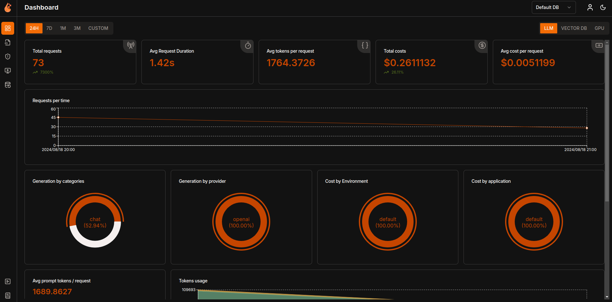
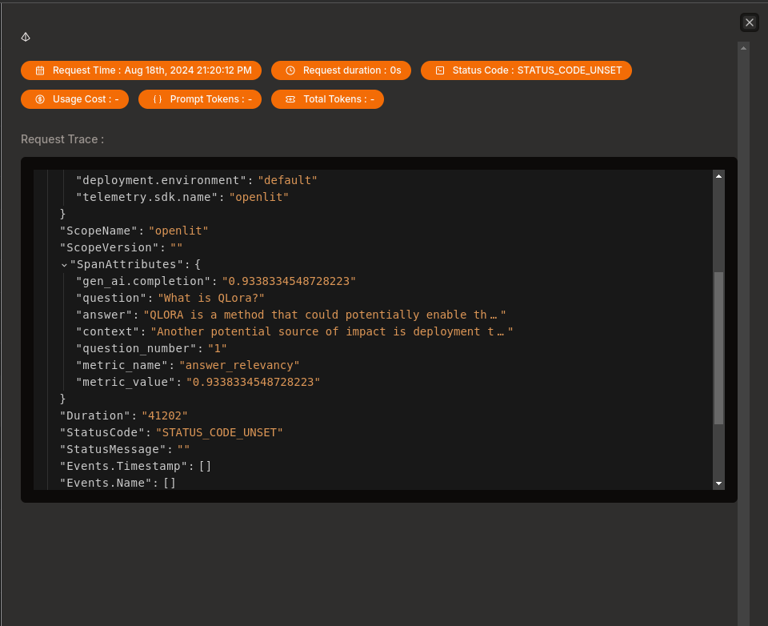

# README

This repository implements Ragas Metrics on a RAG system with OpenLIT observability tool.

## Instructions

In order to run this repo:


## Setup Instructions

1. Clone the repository:


```python
$ git clone https://github.com/paulomuraroferreira/Self_correcting_coding_agent.git
$ cd Self_correcting_coding_agent
```

2. Install Dependencies:

```python
$pip install -e .
```

3. Environment Configuration:

Create a .env file and fill the following environment variables:

```python
OPENAI_API_KEY=your_openai_api_key
OTEL_EXPORTER_OTLP_ENDPOINT=http://127.0.0.1:4318
```

4. Run the Application:

4.1. Execute the chunking process

Put the pdfs files in the app/data/pdfs

Run 
    $ python app/chunking.py

4.2. Run fastapi

    $ cd app
    $ uvicorn app:app --reload

4.3 Run OpenLit

    $ git clone git@github.com:openlit/openlit.git
    $ cd openlit
    $ docker compose up -d

4.4 Enter the OpenLit dashboard with the following credential:

    Email: user@openlit.io
    Password: openlituser


4.5. Send the request on the files request.http

Example: 

    ### POST Request to FastAPI
    POST http://127.0.0.1:8000/query
    Accept: application/json
    Content-Type: application/json

    {
    "question": "What is QLora?"
    }

4.6 Check the metrics on the OpenLit dashboard:





